# Project Entities

## Entities
- [x] Admin
- [x] Apiary
- [x] AquacultureBatch
- [x] AquacultureSystem
- [x] Barn
- [x] BreedingRecord
- [x] Coop
- [x] CropBatch
- [x] ExpenseRecord
- [x] Farm
- [x] Field
- [x] Greenhouse
- [x] GrowthRecord
- [x] HealthRecord
- [x] Hive
- [x] Livestock
- [x] Pen
- [x] Pond
- [x] PoultryBatch
- [x] PoultryHouse
- [x] SalesRecord
- [x] Task
- [x] Worker

## Relations

```mermaid
flowchart TD
    Farm[Farm] --> |has many| Livestock
    Farm --> |has many| PoultryBatch[Poultry Batch]
    Farm --> |has many| AquacultureBatch[Aquaculture Batch]
    Farm --> |has many| CropBatch[Crop Batch]
    Farm --> |has many| Hive
    Farm --> |has many| Worker
    Farm --> |has many| Task
    Farm --> |belongs to| Admin

    %% Housing structures
    Farm --> |has many| Barn
    Farm --> |has many| Pen
    Farm --> |has many| PoultryHouse[Poultry House]
    Farm --> |has many| Coop
    Farm --> |has many| AquacultureSystem[Aquaculture System]
    Farm --> |has many| Pond
    Farm --> |has many| Field
    Farm --> |has many| Greenhouse
    Farm --> |has many| Apiary

    %% Secondary housing relationships
    Barn --> |has many| Pen
    PoultryHouse --> |has many| Coop
    AquacultureSystem --> |has many| Pond
    Apiary --> |has many| Hive

    %% Animals and their housing
    Livestock --> |housed in| Pen
    PoultryBatch --> |housed in| Coop
    AquacultureBatch --> |housed in| Pond
    CropBatch -.-> |grown in| Field
    CropBatch -.-> |grown in| Greenhouse

    %% Records
    Livestock --> |has many| GrowthRecord[Growth Record]
    Livestock --> |has many| HealthRecord[Health Record]
    Livestock --> |has many| ExpenseRecord[Expense Record]
    Livestock --> |has many| BreedingRecord[Breeding Record]

    PoultryBatch --> |has many| GrowthRecord
    PoultryBatch --> |has many| HealthRecord
    PoultryBatch --> |has many| ExpenseRecord
    PoultryBatch --> |has many| SalesRecord[Sales Record]

    AquacultureBatch --> |has many| GrowthRecord
    AquacultureBatch --> |has many| HealthRecord
    AquacultureBatch --> |has many| ExpenseRecord
    AquacultureBatch --> |has many| SalesRecord

    CropBatch --> |has many| ExpenseRecord
    Hive --> |has many| ExpenseRecord

    %% Housing expenses
    Barn --> |has many| ExpenseRecord
    Pen --> |has many| ExpenseRecord
    PoultryHouse --> |has many| ExpenseRecord
    Coop --> |has many| ExpenseRecord
    AquacultureSystem --> |has many| ExpenseRecord
    Pond --> |has many| ExpenseRecord
    Field --> |has many| ExpenseRecord
    Greenhouse --> |has many| ExpenseRecord
    Apiary --> |has many| ExpenseRecord

    %% Worker and tasks
    Admin --> |has many| Worker
    Admin --> |has many| Farm
    Admin --> |has many| Task
    Worker --> |assigned to| Task
    Task --> |for| Barn
    Task --> |for| Pen

    %% Livestock breeding relationships
    Livestock --> |mother of| Livestock
    Livestock --> |father of| Livestock

    classDef mainEntities fill:#f9d5e5,stroke:#333,stroke-width:1px;
    classDef housingEntities fill:#eeeeee,stroke:#333,stroke-width:1px;
    classDef recordEntities fill:#d5f9e5,stroke:#333,stroke-width:1px;
    classDef userEntities fill:#d5e5f9,stroke:#333,stroke-width:1px;

    class Farm,Livestock,PoultryBatch,AquacultureBatch,CropBatch,Hive mainEntities;
    class Barn,Pen,PoultryHouse,Coop,AquacultureSystem,Pond,Field,Greenhouse,Apiary housingEntities;
    class GrowthRecord,HealthRecord,ExpenseRecord,BreedingRecord,SalesRecord recordEntities;
    class Admin,Worker,Task userEntities;
```

